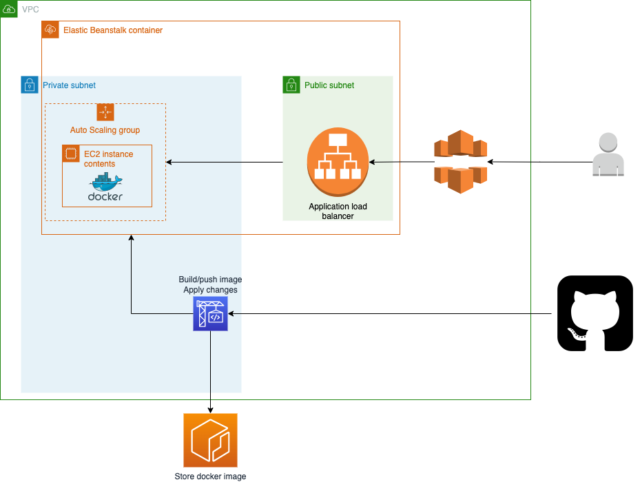

## Architecture

## URLs
* HTTP - http://luisguerra-timeoff.us-west-2.elasticbeanstalk.com
* HTTPS - https://d1v7s7tqi50pcn.cloudfront.net/login/

## Requirements

| Name | Version |
|------|---------|
|  [terraform](#requirement\_terraform) | >= 1.2 |
|  [aws](#requirement\_aws) | 4.15.1 |

## Providers

| Name | Version |
|------|---------|
|  [aws](#provider\_aws) | 4.15.1 |

## Modules

| Name | Source | Version |
|------|--------|---------|
|  [vpc](#module\_vpc) | terraform-aws-modules/vpc/aws | 3.14.0 |

## Resources

| Name | Type |
|------|------|
| [aws_cloudfront_distribution.timeoff_distr](https://registry.terraform.io/providers/hashicorp/aws/4.15.1/docs/resources/cloudfront_distribution) | resource |
| [aws_codebuild_project.cicd_timeoff](https://registry.terraform.io/providers/hashicorp/aws/4.15.1/docs/resources/codebuild_project) | resource |
| [aws_codebuild_webhook.timeoff_webhook](https://registry.terraform.io/providers/hashicorp/aws/4.15.1/docs/resources/codebuild_webhook) | resource |
| [aws_ecr_repository.timeoff](https://registry.terraform.io/providers/hashicorp/aws/4.15.1/docs/resources/ecr_repository) | resource |
| [aws_elastic_beanstalk_application.timeoff_mgmt_app](https://registry.terraform.io/providers/hashicorp/aws/4.15.1/docs/resources/elastic_beanstalk_application) | resource |
| [aws_elastic_beanstalk_environment.timeoff_mgmt_env](https://registry.terraform.io/providers/hashicorp/aws/4.15.1/docs/resources/elastic_beanstalk_environment) | resource |
| [aws_iam_role.codebuild_role](https://registry.terraform.io/providers/hashicorp/aws/4.15.1/docs/resources/iam_role) | resource |
| [aws_iam_role_policy.timeoff_mgmt_policy](https://registry.terraform.io/providers/hashicorp/aws/4.15.1/docs/resources/iam_role_policy) | resource |
| [aws_security_group.app_sg](https://registry.terraform.io/providers/hashicorp/aws/4.15.1/docs/resources/security_group) | resource |
| [aws_security_group.vpcendpoint_sg](https://registry.terraform.io/providers/hashicorp/aws/4.15.1/docs/resources/security_group) | resource |
| [aws_vpc_endpoint.cloudformation](https://registry.terraform.io/providers/hashicorp/aws/4.15.1/docs/resources/vpc_endpoint) | resource |
| [aws_vpc_endpoint.ecr](https://registry.terraform.io/providers/hashicorp/aws/4.15.1/docs/resources/vpc_endpoint) | resource |
| [aws_vpc_endpoint.ecr_dkr](https://registry.terraform.io/providers/hashicorp/aws/4.15.1/docs/resources/vpc_endpoint) | resource |
| [aws_vpc_endpoint.elasticbeanstalk](https://registry.terraform.io/providers/hashicorp/aws/4.15.1/docs/resources/vpc_endpoint) | resource |
| [aws_vpc_endpoint.elasticbeanstalk_health](https://registry.terraform.io/providers/hashicorp/aws/4.15.1/docs/resources/vpc_endpoint) | resource |
| [aws_vpc_endpoint.s3](https://registry.terraform.io/providers/hashicorp/aws/4.15.1/docs/resources/vpc_endpoint) | resource |
| [aws_vpc_endpoint.s3_gateway](https://registry.terraform.io/providers/hashicorp/aws/4.15.1/docs/resources/vpc_endpoint) | resource |
| [aws_vpc_endpoint.sqs](https://registry.terraform.io/providers/hashicorp/aws/4.15.1/docs/resources/vpc_endpoint) | resource |
| [aws_cloudfront_cache_policy.optimized](https://registry.terraform.io/providers/hashicorp/aws/4.15.1/docs/data-sources/cloudfront_cache_policy) | data source |